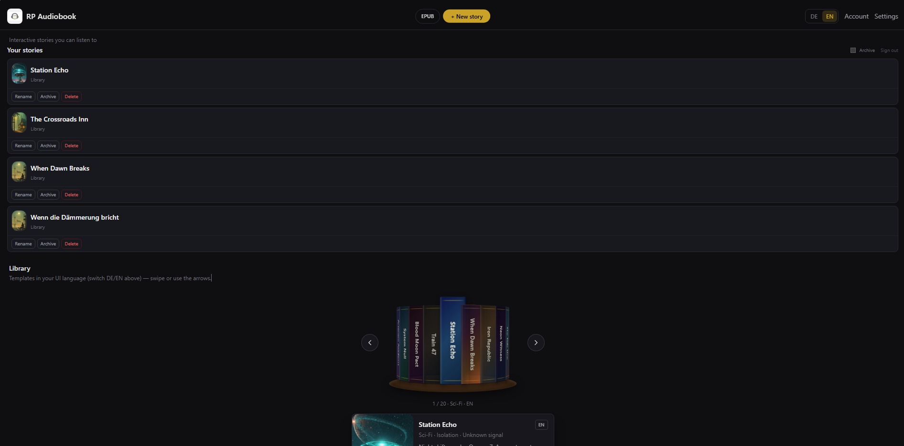
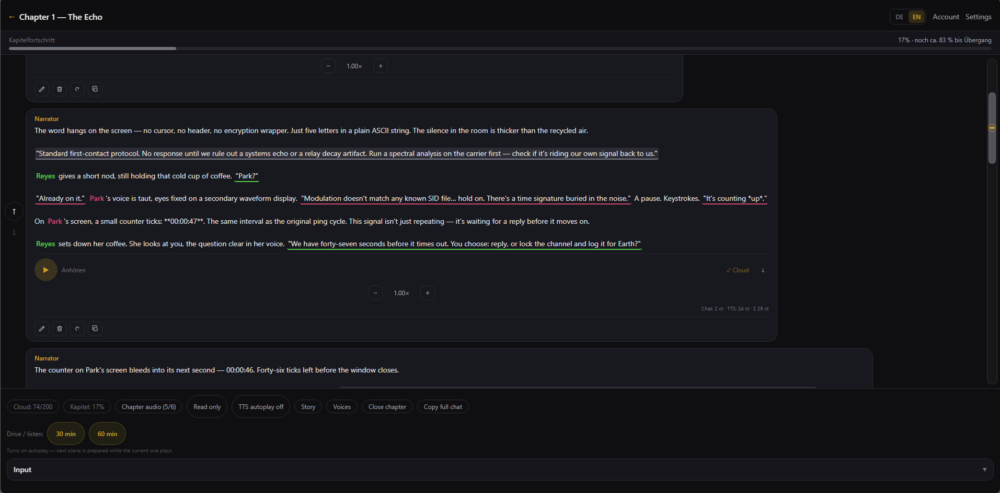
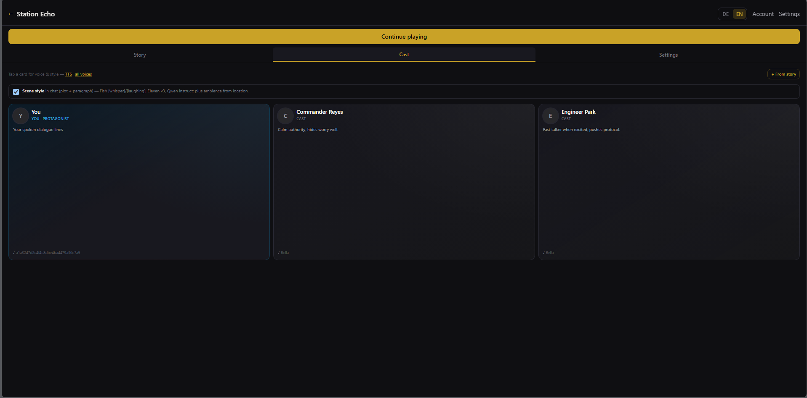
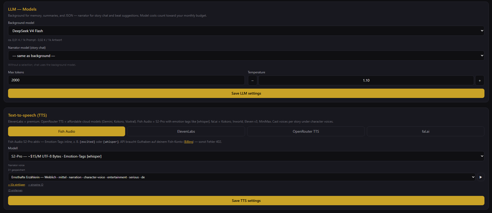
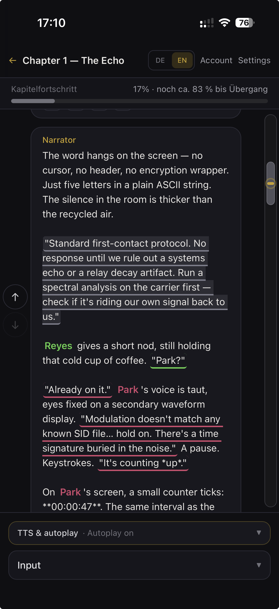

<p align="center">
  
</p>

<h1 align="center">RP Audiobook</h1>

<p align="center">
  <strong>Interactive stories you can listen to</strong><br>
  <em>Interaktive Geschichten zum Anhören</em>
</p>

<p align="center">
  Play AI-driven RPG narratives in the browser — write, roleplay, and hear the narrator speak.<br>
  Runs <strong>locally on your machine</strong> by default. No cloud account required.
</p>

<p align="center">
  <a href="LICENSE"></a>
  <a href="https://nextjs.org"></a>
  
  <a href="docs/LOCAL-FIRST.md"></a>
</p>

<p align="center">
  <a href="#quick-start">Quick start</a> ·
  <a href="#demo">Demo</a> ·
  <a href="#screenshots">Screenshots</a> ·
  <a href="#features">Features</a> ·
  <a href="docs/README.md">Docs</a>
</p>

---

## What is this?

**RP Audiobook** is an open-source interactive fiction / tabletop-RPG-style storyteller:

- Pick a library template or import EPUB / character cards
- Chat with an AI narrator; branch the plot with **Say**, reactions, and cast dialogue
- Optional **text-to-speech** — Kokoro offline on your GPU, or bring your own Fish / ElevenLabs / OpenRouter keys
- **Soundscape** — ambience, SFX, and music on the client
- **Local-first:** stories live in **IndexedDB**; API keys stay in **your browser** unless you self-host SaaS mode

> This repo is meant for **local use**. Running a public multi-user host needs your own legal pages, keys, and compliance — see [docs/OPEN-SOURCE.md](docs/OPEN-SOURCE.md).

---

## Demo

<p align="center">
  <a href="https://ekale007.github.io/RPAudiobook/demo/"><strong>▶ Open demo player</strong></a>
  <br>
  <sub>Inline playback · enable once: Settings → Pages → branch <code>master</code>, folder <code>/docs</code></sub>
</p>

**EN — Narrator**

<video controls preload="metadata" width="100%" src="https://raw.githubusercontent.com/ekale007/RPAudiobook/master/docs/assets/readme/demo-narrator-en.mp3"></video>

**Multi-voice cast**

<video controls preload="metadata" width="100%" src="https://raw.githubusercontent.com/ekale007/RPAudiobook/master/docs/assets/readme/demo-multivoice.mp3"></video>

**Soundscape**

<video controls preload="metadata" width="100%" src="https://raw.githubusercontent.com/ekale007/RPAudiobook/master/docs/assets/readme/demo-soundscape.mp3"></video>

<sub>Players not showing? Use the <a href="https://ekale007.github.io/RPAudiobook/demo/">demo page</a> or
<a href="https://raw.githubusercontent.com/ekale007/RPAudiobook/master/docs/assets/readme/demo-narrator-en.mp3">direct stream</a> (opens the browser audio player).</sub>

---

## Screenshots

<table>
  <tr>
    <td align="center" width="50%">
      <a href="docs/assets/readme/screenshot-library.png">
        
      </a>
      <br><sub><b>Library</b> — bundled templates &amp; your stories</sub>
    </td>
    <td align="center" width="50%">
      <a href="docs/assets/readme/screenshot-chat.png">
        
      </a>
      <br><sub><b>Chat</b> — play turns, listen to narration</sub>
    </td>
  </tr>
  <tr>
    <td align="center">
      <a href="docs/assets/readme/screenshot-cast.png">
        
      </a>
      <br><sub><b>Cast</b> — multi-voice dialogue</sub>
    </td>
    <td align="center">
      <a href="docs/assets/readme/screenshot-settings.png">
        
      </a>
      <br><sub><b>Settings</b> — local TTS &amp; BYOK keys</sub>
    </td>
  </tr>
  <tr>
    <td align="center" colspan="2">
      <a href="docs/assets/readme/screenshot-mobile.webp">
        
      </a>
      <br><sub><b>Mobile</b> — PWA on phone</sub>
    </td>
  </tr>
</table>

---

## Quick start

**Requirements:** Node 20+, npm. Windows scripts for one-command local start; macOS/Linux: `npm run dev` + optional Kokoro.

### Local-first (recommended)

```bash
git clone https://github.com/ekale007/RPAudiobook.git
cd RPAudiobook
npm install
cp .env.example .env.local   # optional — omit Supabase vars for local mode
```

**Windows — Kokoro + app in one step:**

```powershell
npm run start:local
```

Open **http://localhost:3000** → **Settings** → paste your [OpenRouter](https://openrouter.ai/) key → create or import a story. **No sign-in.**

**Manual TTS (any OS):**

```powershell
# Terminal 1 — Kokoro (GPU, offline)
.\scripts\install-kokoro.ps1
npm run tts:kokoro

# Terminal 2
npm run dev
```

Settings → **Local** → engine **kokoro** → Save.  
`HF_TOKEN` in `.env.local` helps model download — [docs/KOKORO-QWEN.md](docs/KOKORO-QWEN.md).

**Quick online TTS:** `pip install -r scripts/requirements-tts.txt` → `npm run tts:server` (edge-tts, port 5123).

### SaaS / self-host (optional)

Supabase migrations in `supabase/migrations/`, set `NEXT_PUBLIC_SUPABASE_*` and legal env vars — [docs/AUTH.md](docs/AUTH.md), [docs/DEPLOY.md](docs/DEPLOY.md).

---

## Features

| | |
|---|---|
| **Stories** | Library templates, EPUB import, character cards & lorebooks |
| **Structure** | Story → band → chapter → turns with AI summaries |
| **Play** | Chat, rewind, reroll, continue; cast with distinct voices |
| **TTS** | Kokoro & edge-tts local; Fish, ElevenLabs, OpenRouter TTS (BYOK) |
| **Audio UX** | Media session, drive mode, read-only mode (no TTS pause for music apps) |
| **Privacy** | Local mode: IndexedDB + localStorage on your device |

### Deployment modes

| Mode | Login | Data | Best for |
|------|-------|------|----------|
| **Local-first** | None | IndexedDB | OSS / desktop |
| **SaaS** | Supabase | Cloud sync + wallet | Self-hosted or hosted instance |

Details: [docs/LOCAL-FIRST.md](docs/LOCAL-FIRST.md) · [docs/DEPLOYMENT-MODES.md](docs/DEPLOYMENT-MODES.md)

---

## Scripts

| Command | Purpose |
|---------|---------|
| `npm run dev` | Dev server (LAN `0.0.0.0`) |
| `npm run start:local` | Kokoro + Next (Windows, local-first) |
| `npm run tts:kokoro` | Kokoro-82M on port 5124 |
| `npm run tts:server` | edge-tts on port 5123 |
| `npm run build` | Production build |

---

## Documentation

| Doc | Topic |
|-----|--------|
| [docs/LOCAL-FIRST.md](docs/LOCAL-FIRST.md) | Local mode architecture |
| [docs/OPEN-SOURCE.md](docs/OPEN-SOURCE.md) | OSS checklist & licensing |
| [docs/PROJECT-STATUS.md](docs/PROJECT-STATUS.md) | Roadmap & status |
| [docs/README.md](docs/README.md) | Full doc index |
| [SECURITY.md](SECURITY.md) | Vulnerability reporting |
| [CONTRIBUTING.md](CONTRIBUTING.md) | How to contribute |

---

## License

[GNU Affero General Public License v3.0 or later](LICENSE) (AGPL-3.0-or-later).

You may run and modify locally freely. If you offer this software as a **network service** to others, AGPL requires making corresponding source available to users.

---

<p align="center">
  <sub>Built for storytellers who want the plot in their ears, not just on the screen.</sub>
</p>
