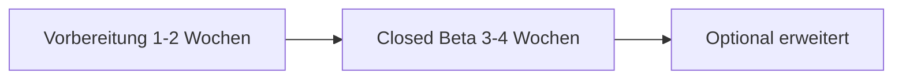

# Offizielle Beta-Testphase — Plan

Stand: Vorbereitung stabiler Closed Beta (Freunde & Familie), danach optional erweiterte Runde.  
OmniVoice bleibt **lokal** und außerhalb dieses Plans (späterer Technik-Track).

---

## 1. Zielbild

| Ziel | Bedeutung |
|------|-----------|
| **Präsentierbar** | Erster Eindruck in &lt; 2 Min: Login → Bibliothek → Chat → TTS ohne Erklärbedarf |
| **Sicher** | Invite-only, Limits, keine Datenlecks, klare Fehlermeldungen |
| **Rechtlich abgesichert** | Öffentliche URL mit Impressum, Datenschutz, Nutzungsbedingungen |
| **Inhaltlich sauber** | Nur eigene/lizenzierte Vorlagen; Nutzer-Hinweise zu Fanfic & Uploads |
| **Steuerbar** | Admin: Tier, Kosten, **Modell-Listen pro Tier** |

---

## 2. Ist-Stand (kurz)

### Bereits vorhanden

- Auth: Supabase, Passwort-Login, Reset, Invite-only-Modus (`docs/BETA-AUTH.md`)
- Tier: `free` \| `beta` \| `pro` in DB, Limits, Verbrauchslog, `/admin`, `/account`
- Free-Modelle: fest verdrahtet + Override per Env `BETA_TIER_FREE_MODELS` (`src/lib/server/userTier.ts`)
- Smoke-Test-Checkliste: `docs/SMOKE-TEST.md`
- Bibliothek: eigene Vorlagen („HörbuchKI Library“, remixbar), DE/EN
- iOS PWA, TTS-Kette, Protagonist beim Import

### Lücken vor „offizieller“ Beta

| Bereich | Lücke | Priorität |
|---------|--------|-----------|
| Recht | Keine Seiten Impressum / Datenschutz / AGB | **P0** |
| Onboarding | Keine Einleitung, wenig kontextuelle Tooltips | **P0** |
| Admin UI | Modell-Listen nur per Env, nicht im Admin-UI | **P1** |
| Content-Audit | Kein dokumentiertes Copyright-Register der Vorlagen | **P0** |
| Beta-Ops | Kein festes Feedback-Formular / Kanal | **P1** |
| Monitoring | Kein einfaches „Health“-Dashboard für dich | **P2** |

---

## 3. Phasenplan

### Phase 0 — Vorbereitung (du allein / 1–2 Wochen)

**Technik & Stabilität**

- [ ] Prod-Deploy nach jedem Release: `docs/SMOKE-TEST.md` abhaken (Auth, LLM, TTS DE+EN, Bibliothek, Mobile)
- [ ] Supabase: Sign-up **aus**, Anonymous **aus**, Redirect-URLs Prod + lokal
- [ ] `NEXT_PUBLIC_BETA_INVITE_ONLY=1` auf Vercel
- [ ] Env-Prod prüfen: `ADMIN_USER_IDS`, `SUPABASE_SERVICE_ROLE_KEY`, OpenRouter, ElevenLabs, Limits
- [ ] Ein „Known issues“-Abschnitt (z. B. Rate-Limits, nur Cloud-TTS auf Vercel)

**Account-System**

- [ ] 3 Test-Accounts: `free` (Default), `beta`, `pro` — jeweils 1× durchklicken
- [ ] Invite-Workflow: Mail → Link → Passwort → Login → Tier `beta` setzen
- [ ] `/account`: Tarif, Verbrauch, Link zu Admin nur für dich

**Admin — Modelle pro Tier (Zielbild)**

Aktuell: Free-IDs per Code/Env; Beta/Pro = voller Katalog.

| Tier | Modelle (Beispiel-Ziel) | Konfiguration heute | Ziel |
|------|-------------------------|---------------------|------|
| **free** | Nur günstige Flash-Modelle (OpenRouter) | `BETA_TIER_FREE_MODELS` JSON in Vercel | Admin-UI: Checkbox-Liste aus Katalog |
| **beta** | Voller Katalog oder „Beta-Whitelist“ | Env / alles | Admin: optional eingeschränkte Liste |
| **pro** | Voller Katalog | `null` = alle | unverändert |

Umsetzung (später, 1–2 Tage Dev): Migration `tier_allowed_models jsonb` oder Tabelle `tier_model_policy`; Admin-Tab „Modelle“; API `/api/llm/models` filtert danach.

**Bis die UI steht:** Free-Liste in Vercel dokumentieren und nur kostenarme Modelle eintragen (siehe `docs/BETA-BILLING.md`).

**Rechtliches (öffentliche Web-App)**

Mindestens drei statische Seiten + Footer-Links:

| Seite | Inhalt (DE, kurz verständlich) |
|-------|--------------------------------|
| **Impressum** | Name, Kontakt, ggf. „privates Beta-Projekt“ / Verantwortlicher |
| **Datenschutz** | Supabase (EU), Vercel, OpenRouter, ElevenLabs, Speicherdauer Stories/TTS, Rechte Auskunft/Löschung |
| **Nutzungsbedingungen** | Beta „as is“, kein Missbrauch, **kein unbefugtes Voice-Cloning**, Nutzer-Inhalte in eigener Verantwortung, Kündigung/Löschung Account |

Zusätzlich im Produkt:

- Hinweis beim ersten Login: „Beta — Daten & KI-Dienste“ (1× bestätigen)
- Settings: Link zu Datenschutz
- Bibliothek: „Vorlagen © HörbuchKI — remixbar für private Nutzung in der App“

**Hinweis:** Keine Rechtsberatung — bei Unsicherheit kurz mit jemandem klären, ob Impressumspflicht greift (auch kostenlose Beta kann „geschäftsmäßig“ sein, wenn öffentlich beworben).

**Copyright & Inhalte**

Siehe Checkliste `docs/BETA-CONTENT-LEGAL.md` (separat). Kurz:

- Bibliothek: nur **eigene** Texte; `creator: "HörbuchKI Library"` beibehalten
- Seed unter `src/data/seed/library/` — keine Fremd-Marken in `creator_notes` (erledigt)
- **Keine** markenrechtlich geschützten Welten (Marvel, HP, …) in Standard-Vorlagen
- Nutzer-Stories: AGB — Nutzer verantwortlich, du bietest nur Tool
- Cover-Bilder: dokumentieren (KI-generiert / selbst erstellt / Lizenz)

**Onboarding & Tooltips (wenig, aber klar)**

| Moment | Was der Nutzer sieht |
|--------|----------------------|
| Erster Login | Overlay: 3 Schritte — „Bibliothek wählen → Protagonist → Chat mit Kopfhörern“ |
| Story-Hub | Tooltip Cast: „Stimmen pro Figur“ |
| Chat | Tooltip: Eingabe-Klappe, Say, Reaktionen; TTS = Lautsprecher-Icon |
| Settings | „Beta: Server-TTS, Limits unter Account“ |

Kein 10-Minuten-Tutorial — **eine** Einleitung + 3–5 kontextuelle Hints (localStorage `onboarding_done`).

---

### Phase 1 — Closed Beta (3–4 Wochen, 8–15 Personen)

**Zielgruppe:** Freunde, Familie, 1–2 „power user“ mit Feedback-Kultur.

**Einladung**

1. Supabase Invite (E-Mail)
2. Nach erstem Login: `tier = beta` (Admin oder SQL)
3. Kurze **Willkommens-Nachricht** (Vorlage unten)

**Was du messen willst**

| Signal | Wie |
|--------|-----|
| Kommt jemand durch? | Mind. 1 Story importiert + 5 Chat-Turns |
| TTS Mobile | iOS PWA + Lockscreen (deine erfolgreichen Tests) |
| Verständlichkeit | „Wo warst du stuck?“ (1 Frage) |
| Kosten | `/admin` Verbrauchslog pro User |

**Feedback**

- Ein Kanal reicht: WhatsApp-Gruppe **oder** Google Form (3 Fragen)
- Wöchentlich 15-Min-Sync mit 1–2 aktiven Testern

**Scope Freeze**

- Keine großen Features in Phase 1 (nur Bugs, Recht, Copy)
- OmniVoice, neue Engines → Phase 2+

---

### Phase 2 — Optional erweiterte Beta (+4 Wochen)

- 30–50 Nutzer, weiter Invite-only
- `free`-Tier bewusst testen (Limits, Modell-Whitelist)
- Erst danach: öffentlicher Landing-Text, leichte Werbung (Abschnitt 5)

---

## 4. Mundpropaganda — Skript für Freunde & Familie

**30-Sekunden-Version**

> „Ich baue eine App, mit der du interaktive Hörbuch-Stories spielst — du schreibst, was passiert, und sie wird vorgelesen. Es ist eine **geschlossene Beta**: ich schick dir einen Einladungslink. Brauchst nur Browser am Handy, am besten Kopfhörer. Dauert 10 Minuten zum Ausprobieren — sag mir danach ehrlich, wo es hakt.“

**Was du NICHT versprichst**

- Unbegrenzte Nutzung
- Studio-Qualität wie Audible
- Dass alle Modelle/Stimmen gratis bleiben

**Was du mitgibst**

- Link: Prod-URL
- „Bei Fehler: Screenshot + Uhrzeit“
- Optional: 1 Demo-Story („Welche Vorlage am besten?“)

---

## 5. Leichte Werbung — wo, wann, wie

### Timing

| Wann | Aktion |
|------|--------|
| **Vor Werbung** | Phase-0-Checkliste grün, Rechtsseiten live, 5 interne Smoke-Tests |
| **Woche 1–2 Beta** | Nur privates Netz (kein Reddit/Twitter) |
| **Ab Woche 3–4** | Wenn &lt; 3 kritische Bugs: 1 öffentlicher Post |

### Kanäle (niedriges Risiko zuerst)

| Kanal | Aufwand | Nutzen |
|-------|---------|--------|
| Persönliches Netzwerk | gering | hoch, vertrauensvoll |
| Kleiner Blog / Newsletter | mittel | gut für „Was ist HörbuchKI?“ |
| Discord (eigenes oder Indie-Dev) | mittel | Feedback, keine Massen |
| Reddit (r/interactivefiction, r/SideProject) | mittel | Reichweite, **nur mit Impressum/Datenschutz** |
| Twitter/X / Mastodon | gering | Teaser + Link zu Warteliste |

### Ein Mini-Post (Vorlage)

> **HörbuchKI (Beta)** — interaktive Story mit Sprachausgabe im Browser. Du steuerst die Handlung, der Erzähler antwortet und liest vor (DE/EN). Geschlossene Beta, begrenzte Plätze. Interesse? DM / E-Mail für Invite.  
> [Link] · Datenschutz: [Link]

### Was auf der Landing fehlen darf

- Offenes Sign-up ohne Invite (Kosten + Spam)
- Versprechen „kostenlos für immer“
- Fremde IPs / Charaktere in Screenshots

---

## 6. Präsentation — Ablauf „Demo-Abend“

Für 2–5 Personen live (z. B. Familie):

1. **5 Min** — Konzept: interaktiv + TTS, nicht ChatGPT mit Text
2. **Live** — Import `when-dawn-breaks` oder DE-Vorlage, Protagonist, 1 Chat-Turn, TTS abspielen (iPhone)
3. **2 Min** — Cast / Stimmen, kurz Settings
4. **Q&A** — Feedback-Formular-Link

Technik: Handy im WLAN, Prod-URL, vorher Smoke-Test am gleichen Gerät.

---

## 7. Master-Checkliste „Go für erste Tester“

### P0 (ohne diese nicht einladen)

- [ ] Smoke-Test Prod komplett grün
- [ ] Invite-only aktiv, Test-Invite durchgespielt
- [ ] Impressum + Datenschutz + Nutzungsbedingungen verlinkt
- [ ] Content-Audit Bibliothek (`docs/BETA-CONTENT-LEGAL.md`)
- [ ] Free-Tier-Modelle in Vercel auf günstige IDs gesetzt
- [ ] Willkommens-Text + Feedback-Kanal bereit

### P1 (erste Woche nach Start)

- [ ] Onboarding-Overlay + 3 Tooltips
- [ ] Admin: Tier für Tester auf `beta`
- [ ] Known-issues in README oder `/account`

### P2 (nach Closed Beta)

- [ ] Admin-UI Modell-Whitelist
- [ ] Warteliste / Interesse-Formular
- [ ] Erweiterte Beta oder Stripe-Vorbereitung

---

## 8. Verwandte Docs

| Dokument | Thema |
|----------|--------|
| `BETA-AUTH.md` | Invite-only Supabase |
| `BETA-BILLING.md` | Tier, Limits, Free-Modelle |
| `SMOKE-TEST.md` | Deploy-Checkliste |
| `BETA-CONTENT-LEGAL.md` | Copyright-Inventar Vorlagen |
| `DEPLOY.md` | Vercel / Env |

---

## 9. Nächster konkreter Schritt (empfohlen)

1. **`docs/BETA-CONTENT-LEGAL.md`** durchgehen und jede Bibliotheks-Vorlage abhaken  
2. **Rechtsseiten** (Impressum, Datenschutz, AGB) als `/legal/*` anlegen  
3. **Onboarding-Overlay** (1 Screen) + Footer-Links  
4. **5 Invites** an vertraute Tester — Phase 1 starten  
5. Parallel: Ticket „Admin Modell-Whitelist“ für Phase 2  

OmniVoice: bewusst **nicht** Teil dieser Beta — erst nach stabiler Cloud-TTS-Erfahrung.
