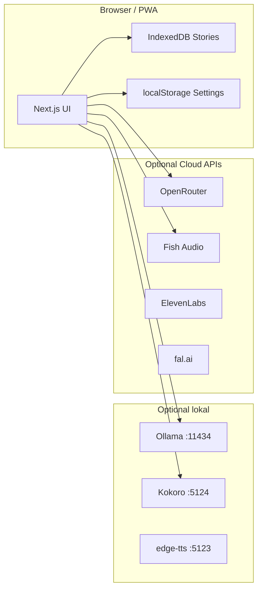

# Local-First — komplett lokal ohne Supabase/Vercel

**Ziel:** RP Audiobook als **lokal ausführbare App** (PC/Mac/Linux): keine Cloud-Accounts nötig. Optional Cloud-APIs (OpenRouter, Fish, …) oder **Ollama + lokales TTS**.

**Hosted SaaS** (`rp-audiobook.vercel.app`) bleibt separat — Werbung, Convenience, Wallet.

Siehe auch: [OPEN-SOURCE.md](./OPEN-SOURCE.md)

---

## 1. Drei Betriebsarten (Ziel)

| Modus | Daten | LLM | TTS | Login |
|-------|--------|-----|-----|-------|
| **Local-First** (OSS-Kern) | IndexedDB im Browser | Ollama / OpenRouter / … | Kokoro lokal / APIs | Keiner |
| **Self-Host Server** (optional) | Eigene Supabase | Server-Proxy | Server-Proxy | Optional |
| **Hosted SaaS** | Supabase Prod | Vercel Keys | Vercel Keys | Supabase Auth |

Dein Fokus: **Local-First** als Hauptprodukt für GitHub.

---

## 2. Was im Code schon existiert

| Baustein | Stand |
|----------|--------|
| `localStoryDb.ts` | IndexedDB: stories, turns, cast, lore, chapters |
| `localStories.ts` | CRUD für lokale Stories |
| `shouldStoreStoryLocally()` | In **local** mode: alle Origins → IndexedDB; SaaS: nur EPUB + Editor |
| `deploymentMode.ts` | `saas` wenn Supabase-Env gesetzt, sonst `local` (oder `NEXT_PUBLIC_DEPLOYMENT_MODE`) |
| Homepage / story/new / import | Local mode: kein Login, `localDeploymentUserId()` |
| `/login`, `/signup`, `/account`, `/admin` | Redirect nach `/` in local mode |
| `npm run start:local` | Kokoro + Next mit `DEPLOYMENT_MODE=local` |
| `isSupabaseConfigured()` | Ohne Env → local mode (App nutzbar) |

---

## 3. Ziel-Architektur (Local-First)



**Prinzip:** Alles Persönliche bleibt auf dem Gerät. Cloud nur wenn der Nutzer Keys einträgt.

---

## 4. Umbau-Phasen

### Phase L1 — „Local Only“ Modus (Grundlage)

Env: `NEXT_PUBLIC_DEPLOYMENT_MODE=local` (oder Auto wenn keine Supabase-Env).

| Task | Details |
|------|---------|
| Homepage ohne Login | Bibliothek, neue Story, EPUB → alles in IndexedDB |
| `listStories()` | Kein `createClient()` wenn Local-Only |
| `shouldStoreStoryLocally()` | **Alle** Story-Origins lokal (Bibliothek, Editor, Import) |
| Routen `/login`, `/account`, Wallet | Ausblenden oder Redirect |
| Billing / `requireSpendableBalance` | In Local-Only: API-Routes optional oder Client-only LLM |
| Legal-Footer | „Lokal — keine Cloud“ |

**Ergebnis:** `npm run dev` ohne `.env` → App läuft, Stories lokal.

### Phase L2 — LLM: Ollama + bestehende APIs

| Provider | Implementierung |
|----------|-----------------|
| **Ollama** | `streamOllamaChat()` → `http://127.0.0.1:11434/api/chat` (OpenAI-kompatibel) |
| **OpenRouter** | Bereits: direkt vom Client mit User-Key |
| **Lokal (Next API)** | Optional: `/api/llm/chat` ohne Auth in Local-Only |

Settings-UI:

- LLM-Anbieter: Ollama | OpenRouter | (später LM Studio, OpenAI-kompatibel generisch)
- Ollama: Base-URL, Modell (`llama3`, `mistral`, …), Health-Check-Button

### Phase L3 — TTS: einheitliche Auswahl

Bereits vorhanden, in Local-Only priorisieren:

| Provider | Typ | Start |
|----------|-----|--------|
| **Kokoro / local** | GPU lokal | `npm run tts:kokoro` |
| **edge-tts** | CPU lokal | `npm run tts:server` |
| **ElevenLabs** | Cloud (User-Key) | Settings |
| **Fish Audio** | Cloud (User-Key oder lokaler Proxy) | Settings / eigener Key |
| **fal.ai** | Cloud | Settings |

Local-Only: **kein** Turn-Audio in Supabase Storage → MP3 in IndexedDB (`ttsAudioCache`) oder `blob` auf Turn (erweitern).

### Phase L4 — Ein-Klick-Start

```powershell
npm run start:local-full   # (neu)
# → prüft Ollama (optional)
# → startet Kokoro (optional)
# → next dev auf 0.0.0.0:3000
```

+ `docs/LOCAL-FIRST.md` Quick Start (DE/EN)
+ `.env.local.example` nur mit `NEXT_PUBLIC_LOCAL_ONLY=1` und optionalen URLs

### Phase L5 — „Executable“ (optional später)

| Option | Aufwand |
|--------|---------|
| **PWA + Browser** | Gering — reicht für viele Nutzer |
| **Electron / Tauri** | Mittel — ein `.exe`, bundled Ollama-Hinweis |
| **Docker Desktop** | Mittel — Next + Ollama + Kokoro in Compose |

Für OSS reicht zunächst: **klare Docs + `start:local-full`**.

---

## 5. Settings-UI (Ziel für „einfach einstellbar“)

Ein Tab **„Lokal vs Cloud“** in Settings:

### LLM

1. **Ollama (lokal)** — URL, Modell, Test-Prompt  
2. **OpenRouter** — API-Key, Modell-Picker  
3. (später) OpenAI-kompatibel (eigene URL)

### TTS

1. **Lokal (Kokoro)** — Stimme, Port, „Server starten“-Hinweis  
2. **ElevenLabs** — Key, Stimme  
3. **Fish Audio** — Key, Stimme  
4. **fal.ai** — Key, Modell  

Health-Checks: `GET /api/health` erweitern oder Client pingt `11434/api/tags`, `5124/health`.

---

## 6. Was wegfällt / optional wird (Local-Only)

| Feature | Local-Only |
|---------|------------|
| Supabase Auth | Nicht nötig |
| Wallet / Stripe | Aus |
| Cloud Turn-Audio | IndexedDB / lokal |
| Admin `/admin` | Aus |
| Sync zwischen Geräten | Nicht (Export/Import JSON später) |
| Rate Limits Server | Nicht (eigene API-Keys) |

---

## 7. Open Source + Hosted (klar getrennt)

| | **GitHub OSS** | **Vercel SaaS** |
|--|----------------|-----------------|
| Zielgruppe | Privacy, Self-contained, Modder | „Einfach loslegen“ |
| Setup | `npm run start:local-full` | URL öffnen, Account |
| Kosten | Hardware + eigene API-Keys | Wallet / Abo |
| Code | AGPL (Empfehlung) | Gleicher Code, Env = SaaS |

---

## 8. Empfohlene Reihenfolge

1. **L1** — Local-Only Modus (Homepage, alle Stories IndexedDB, kein Supabase-Zwang)  
2. **L2** — Ollama-Provider  
3. **L3** — TTS-Cloud-Audio lokal speichern (kein Supabase Storage)  
4. **L4** — `start:local-full` + README  
5. LICENSE + Repo public  
6. Hosted SaaS weiter wie heute (separates Vercel-Projekt)

---

## 9. Migration 017 (Hosted)

Für **lokalen Modus irrelevant**. Nur für dein Vercel-SaaS + Supabase Prod.

---

## 10. Nächster Schritt

**Phase L1** ist der kritische Umbau (~3–5 Tage): danach ist die App ohne Accounts nutzbar und passt zu deiner Vision.

Sag Bescheid, wenn wir **L1 + Ollama (L2)** als erstes Implementierungs-Paket starten sollen.
