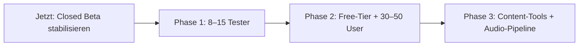

# RP Audiobook — Projektstatus & Wissensbasis

**Repo:** `d:\HörbuchKI` · **Produktname:** RP Audiobook (früher HörbuchKI)  
**Prod:** [https://rp-audiobook.vercel.app](https://rp-audiobook.vercel.app)  
**Stand:** Mai 2026 (Index aktualisiert)

> **OSS (public GitHub):** `image-studio/`, `samples/omnivoice/` und `supabase/migrations/` sind **nicht** im Repo — nur Local-first-Kern + SaaS-**Code** (Supabase-Client). Schema/Migrationen beim Betreiber der gehosteten Instanz.

Dieses Dokument bündelt Erkenntnisse aus Entwicklung und Tests.

---

## 1. Produkt in einem Satz

Interaktives Story-RPG im Browser: Nutzer steuern die Handlung per Chat, der Erzähler antwortet per LLM (OpenRouter) und kann vorgelesen werden (Fish Audio / ElevenLabs / lokal Kokoro). Stories, Kapitel und Cast liegen in Supabase.

---

## 2. Erledigt (wichtigste Meilensteine)


| Bereich            | Inhalt                                                        |
| ------------------ | ------------------------------------------------------------- |
| **Kern-Loop**      | Story → Band → Kapitel → Turns, Rewind/Reroll/Edit/Continue   |
| **Cards & Lore**   | SillyTavern/WryTour-Import, Keyword-Lore, Cast                |
| **Gruppenchat**    | Multi-Speaker, `<<speaker:slug>>`, Voice-Map pro Figur        |
| **TTS Cloud**      | Fish S2-Pro (Beta-Standard), ElevenLabs, OpenRouter TTS       |
| **TTS lokal**      | Kokoro, edge-tts, Qwen/OmniVoice (Experimente)                |
| **Fish Audiobook** | Soundscape (Ambience/Musik/SFX), Ducking, Fish-Emotion-Tags   |
| **Auth**           | Getrennte `/login` und `/signup`, Passwort (kein Magic Link)  |
| **Billing**        | Tier free/beta/pro, Wallet + Stripe, Verbrauchslog, `/admin`  |
| **Bibliothek**     | 20 Vorlagen-Zwillinge DE+EN (`libraryTemplateTwins.ts`)       |
| **UI**             | Zweisprachig DE/EN, RP-Branding, PWA Install-Banner, „Nur lesen“ (iOS) |
| **Admin Pricing**  | LLM/TTS Kosten + Markup pro Modell (`017_provider_pricing.sql`) |
| **iOS TTS-Auto**   | Shared HTML-Audio, Queue-Handoff, Drive-Mode 30 min stabilisiert |
| **Recht**          | `/legal/`*, Beta-Onboarding-Modal                             |
| **Dialog**         | Mixed-Speaker-Attribution (Zitate in Protagonist-Blöcken)     |


**Letzte relevante Commits (master):** iOS TTS-Autoplay-Fix → Cast Multi-Voice Script-Blöcke → Fish Chunk-Limits → Bibliothek Locale-Filter → Admin Provider-Pricing → PWA Install-Banner.

---

## 3. Wichtige technische Erkenntnisse

### 3.1 TTS & Audio


| Thema                   | Erkenntnis                                                                                                             |
| ----------------------- | ---------------------------------------------------------------------------------------------------------------------- |
| **Fish (Prod)**         | Standard auf Beta; API-Key in Vercel. Upstream 401/403 → **502** + `code: "fish_auth"` (nicht Session-401).            |
| **Session-Auth**        | Echte fehlende Session → **401** + `code: "session_required"`.                                                         |
| **Soundscape**          | Ambience/Musik/SFX laufen **client-seitig** (Web Audio), nicht im Fish-MP3. Tags: `<<sfx:rain>>`, `<<music:tension>>`. |
| **Fish generative SFX** | Bewusst **nicht** im Live-Chat — später offline → Supabase Storage.                                                    |
| **iOS Autoplay**        | Shared `<audio>` (`sharedTtsHtmlAudio.ts`); `prepare()` bindet nicht (Prewarm); Queue pausiert statt stoppt. **„Nur lesen“** deaktiviert Session. |
| **Lokal am PC**         | Kokoro Port 5124, edge-tts 5123; Handy im WLAN nutzt PC als Proxy.                                                     |
| **Markup vor TTS**      | `*`-RP-Markup und Speaker-Tags werden vor Synthese entfernt.                                                           |


→ Details: `[FISH-AUDIOBOOK.md](./FISH-AUDIOBOOK.md)`, `[LOCAL-TTS.md](./LOCAL-TTS.md)`, `[MOBILE.md](./MOBILE.md)`

### 3.2 LLM & Dialog


| Thema                | Erkenntnis                                                                                                                                       |
| -------------------- | ------------------------------------------------------------------------------------------------------------------------------------------------ |
| **Speaker-Blöcke**   | Modell vergisst oft `<<speaker:…>>` — `normalizeSpeakerBlocks` + strenger Prompt.                                                                |
| **Mixed quotes**     | In `<<speaker:protagonist>>`-Blöcken können andere sprechen (Kaelen, Lucifer, Vater). Heuristik + optional LLM in `dialogueSpeakerInference.ts`. |
| **„You sound sure“** | Adresse **an** Protagonist, nicht Protagonist-Speech.                                                                                            |
| **Tier-Limits**      | `userTier.ts`; Free-Modelle per `BETA_TIER_FREE_MODELS` in Vercel.                                                                               |


### 3.3 Auth & Supabase


| Thema           | Erkenntnis                                                                                                     |
| --------------- | -------------------------------------------------------------------------------------------------------------- |
| **Magic Link**  | Supabase Free: wenige Mails/Stunde **projektweit** — Passwort-Login bevorzugen.                                |
| **Invite-only** | `NEXT_PUBLIC_BETA_INVITE_ONLY=1` auf Prod.                                                                     |
| **Migrationen** | 001–017 unter `supabase/migrations/` — vor Beta alle auf Prod anwenden (inkl. `016_wallet_stripe.sql`, `017_provider_pricing.sql`). |


### 3.4 Bilder & lokale Tools


| Thema                 | Erkenntnis                                                                       |
| --------------------- | -------------------------------------------------------------------------------- |
| **Image Studio**      | Ausgelagert nach `image-studio/` (SDXL, Port 5125) — **nicht** in Vercel-Deploy. |
| **Bibliotheks-Cover** | Batch via `npm run covers:missing` + `docs/LOCAL-COVERS.md`.                     |
| **Dev-Route**         | `/dev/image-generator` verweist nur noch auf `image-studio/`.                    |


### 3.5 LokalAI (separates Repo `d:\LokalAI`)


| Thema               | Erkenntnis                                                                                             |
| ------------------- | ------------------------------------------------------------------------------------------------------ |
| **Nicht HörbuchKI** | Web-UI Port **8765**, Recovery-API **8766** — CORS-Fehler betreffen LokalAI, nicht RP Audiobook.       |
| **Status (null)**   | Meist Orchestrator nicht erreichbar, nicht echtes CORS.                                                |
| **Fix**             | `Orchestrator.ps1` / `orchestrator.py`: localhost-Origins beliebiger Port erlauben; Stick neu starten. |


---

## 4. Offene Schritte (priorisiert)

### P0 — vor erweiterten Beta-Einladungen

- [x] **Prod-Smoke-Test** komplett (Betreiber, Mai 2026)
- [x] **Supabase Migrationen** 001–017 auf Prod
- [x] **Content-Audit** Bibliothek
- [x] **Fish API-Key** / Free-Tier-Modelle auf Vercel
- [x] **Invite-Workflow** E2E
- [x] **Legal** auf Prod (`NEXT_PUBLIC_LEGAL_*`)
- [ ] **GitHub Security Advisories** aktivieren (optional)

### P1 — Qualität & UX (erste Beta-Wochen)

- [x] Onboarding-Overlay (3 Schritte: Bibliothek → Protagonist → Kopfhörer)
- [x] Kontext-Tooltips (Cast-Stimmen, Say/Reaktionen)
- [x] Admin-UI: Modell-Whitelist pro Tier
- [x] Feedback-Kanal (Env `NEXT_PUBLIC_FEEDBACK_URL` → `/account`)
- [x] **Musik-Assets** in `sfxCatalog.ts` (Kenney CC0 Loops)
- [x] Duplikat-Import verhindern (Bibliothek)
- [x] Rewind/Reroll: klarere Bestätigungstexte
- [x] Streaming-Abbruch (Stop in Chat + GeneratingIndicator, i18n)
- [ ] **5–15 Tester** + Tier `beta` (Ops)
- [x] Known issues auf `/account`

### P2 — nach stabiler Closed Beta

- [ ] Lorebook-/Card-Editor in der App
- [ ] Branching / alternative Timelines
- [ ] Fish generative SFX offline → Storage
- [ ] OmniVoice / Qwen3-TTS Produktionspfad (lokal getestet, nicht Cloud)
- [ ] RunPod Serverless Qwen (optional): `[RUNPOD-SERVERLESS-QWEN.md](./RUNPOD-SERVERLESS-QWEN.md)`
- [ ] Öffentlicher Landing-Text / Warteliste
- [ ] LokalAI CORS-Fix auf USB-Stick deployen

### Uncommitted / Cleanup

*(Siehe Git — OSS-Repo ohne `image-studio/`, `samples/omnivoice/`, `supabase/migrations/`.)*


---

## 5. Zukunftsplan (Phasen)




| Phase                  | Fokus                                                    | Nicht jetzt                          |
| ---------------------- | -------------------------------------------------------- | ------------------------------------ |
| **A — Stabilisierung** | P0-Checkliste, Fish+LLM zuverlässig, Recht, Limits       | OmniVoice Prod, öffentliches Sign-up |
| **B — Closed Beta**    | Feedback, Mobile iOS PWA, Kosten im Admin                | Große Features, Scope Freeze         |
| **C — Erweitert**      | Free-Tier testen, leichte Werbung mit Impressum          | Massen-Marketing                     |
| **D — Produktreife**   | In-App-Editoren, Branching, Offline-SFX, optional RunPod | —                                    |


Ausführlicher Beta-Plan: `[BETA-LAUNCH-PLAN.md](./BETA-LAUNCH-PLAN.md)`

---

## 6. Verzeichnisstruktur


| Pfad                   | Zweck                                                 |
| ---------------------- | ----------------------------------------------------- |
| `src/app/`             | Next.js Routes + API (`/api/llm`, `/api/tts/fish`, …) |
| `src/components/`      | ChatView, MessageAudioPlayer, Story-Hub               |
| `src/lib/chat/`        | Dialog, Speaker-Inference, Prompt                     |
| `src/lib/tts/`         | Fish, Kokoro, playAssistantTurnAudio, soundscape      |
| `src/lib/story/`       | Bibliothek, `libraryTemplateTwins.ts`                 |
| `src/lib/brand.ts`     | RP Audiobook Identität                                |
| `supabase/migrations/` | DB 001–017                                            |
| `AGENTS.md`            | Agent-/Codebase-Index für Cursor                      |
| `public/sfx/`          | Ambience & One-Shots (committed)                      |
| `docs/`                | Diese Wissensbasis + Spezialdocs                      |
| `image-studio/`        | Lokales SDXL-Studio (eigenes npm-Projekt)             |
| `samples/omnivoice/`   | OmniVoice Referenzen & Probes                         |
| `scripts/`             | TTS-Server, Covers, RunPod, Agentmemory-Seed          |


**Nicht versionieren:** `node_modules/`, `.venv-`*, `.env.local`, `.next/`, `Bilder/`

---

## 7. Agentmemory

```powershell
npx @agentmemory/agentmemory   # oder ~\start-agentmemory.ps1
npm run agentmemory:seed
# Viewer: http://localhost:3113
```

---

## 8. Schnellreferenz Befehle


| Befehl                        | Zweck                      |
| ----------------------------- | -------------------------- |
| `npm run dev`                 | App (LAN `0.0.0.0:3000`)   |
| `npm run build`               | Release-Check              |
| `npm run start:local`         | Kokoro + Next (Windows)    |
| `npm run tts:kokoro`          | Lokaler Multi-Voice-Server |
| `npm run covers:missing`      | Fehlende Bibliotheks-Cover |
| `npm run image-studio`        | SDXL-GUI (separat)         |
| `npm run tts:omnivoice:probe` | OmniVoice-Experiment       |


---

## 9. Doc-Index


| Dokument                                           | Thema                            |
| -------------------------------------------------- | -------------------------------- |
| `[README.md](../README.md)`                        | Quick Start                      |
| `[ROADMAP.md](./ROADMAP.md)`                       | Kurz-Roadmap (verweist hierher)  |
| `[BETA-LAUNCH-PLAN.md](./BETA-LAUNCH-PLAN.md)`     | Beta-Phasen, Checklisten         |
| `[SMOKE-TEST.md](./SMOKE-TEST.md)`                 | Prod-Test                        |
| `[FISH-AUDIOBOOK.md](./FISH-AUDIOBOOK.md)`         | Fish + Soundscape                |
| `[BETA-BILLING.md](./BETA-BILLING.md)`             | Tier, Wallet, Stripe             |
| `[BETA-AUTH.md](./BETA-AUTH.md)`                   | Invite-only                      |
| `[EXPERIMENTAL-LOCAL.md](./EXPERIMENTAL-LOCAL.md)` | Image Studio, OmniVoice, LokalAI |


