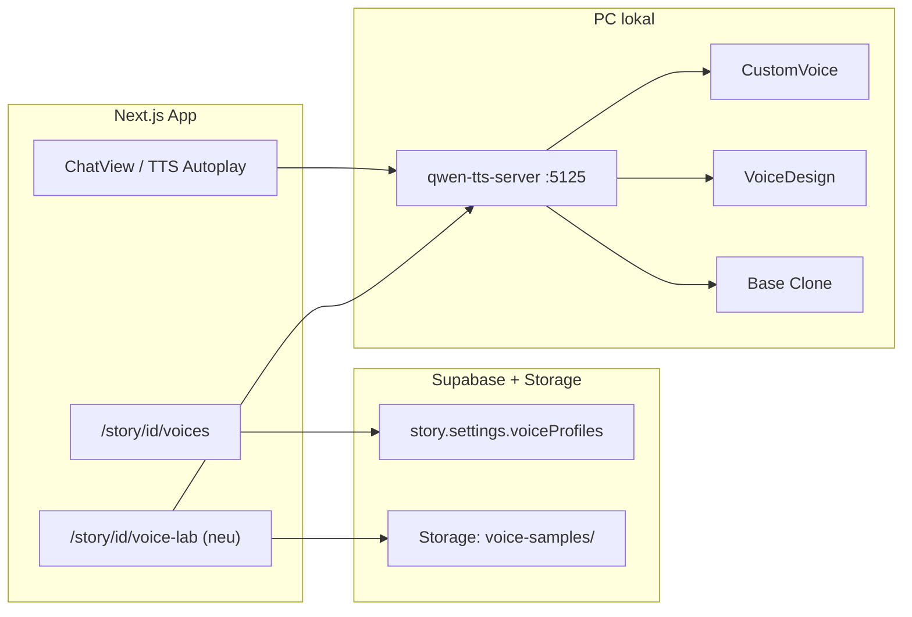

# Qwen3-TTS — Masterplan (später)

**Status:** zurückgestellt — Produktion bleibt bei **Kokoro** (`npm run tts:kokoro`).  
**Ziel:** Qwen als optionale Premium-Engine mit **eigenen Stimmen pro Figur** (Design oder Clone), akzeptabler Latenz auf GTX 1080 Ti (11 GB VRAM).

**Referenz:** [Qwen3-TTS (GitHub)](https://github.com/QwenLM/Qwen3-TTS) · aktueller Stub: `scripts/qwen-tts-server.py` · Port **5125**

---

## 1. Ausgangslage (Mai 2026)

| Was | Stand |
|-----|--------|
| Server | `/speak` + `/health`, nur **CustomVoice** (9 Preset-Stimmen) |
| App | Settings + `/story/[id]/voices` mit Qwen-Picker (Presets) |
| Install | `.venv-qwen`, `npm run tts:qwen:install` |
| Problem | **Zu langsam** (1.7B + erstes Laden + kein Chunk-Cache pro Figur) |
| Fehlt | Voice Design, Voice Clone, Modell-Switching, Performance-Tuning |

**Entscheidung jetzt:** Kokoro für Alltag (schnell, 11 Kokoro-IDs, Gruppenchat getestet). Qwen erst nach Plan unten.

---

## 2. Ziele (Definition of Done)

1. **Latenz:** Erste Silbe / erster `/speak` unter definierter Grenze (z. B. &lt; 8 s nach Warmup auf 1080 Ti mit 0.6B; Zielwerte messen).
2. **Figuren-Stimmen:** Jede Cast-Figur hat eine **stabile** Qwen-Stimme (nicht nur Preset „Ryan“ für alle).
3. **Erzähler-Modus:** Weiterhin ein Erzähler-Slug; Dialog mit Namens-Prefix (`prepareTtsText`) + optional andere Stimme nur für Zitate (später).
4. **Gruppenchat:** Pro `speaker_slug` die hinterlegte Figur-Stimme — analog zu Kokoro `voiceMap`.
5. **UI:** Stimme anlegen (Beschreibung oder 3–10 s Sample), Vorschau, Speichern in Story/Supabase.
6. **Kein Regressions-Risiko:** Engine-Umschaltung Kokoro ↔ Qwen in Settings bleibt; Qwen opt-in.

---

## 3. Qwen-Modi — wann welcher?

| Modell (HF) | VRAM (Richtwert) | Use case in HörbuchKI |
|-------------|------------------|----------------------|
| `Qwen3-TTS-12Hz-0.6B-CustomVoice` | ~4–6 GB | **Schnelltest**, Presets + `instruct` |
| `Qwen3-TTS-12Hz-1.7B-CustomVoice` | ~6–8 GB | Bessere Presets, noch keine Clone |
| `Qwen3-TTS-12Hz-1.7B-VoiceDesign` | ~6–8 GB | **Stimme aus Textbeschreibung** pro Figur |
| `Qwen3-TTS-12Hz-1.7B-Base` | ~6–8 GB | **Clone** aus Referenz-Audio + Transkript |

**Empfehlung für Figuren:**

- **Phase A (einfach):** Voice Design — einmalig Beschreibung speichern, bei jedem `/speak` `generate_voice_design` mit gespeichertem `instruct` / Design-Prompt.
- **Phase B (beste Qualität):** Base + Clone — User nimmt 5–15 s Sample auf oder lädt WAV hoch; `create_voice_clone_prompt` cachen; `generate_voice_clone` für alle Zeilen der Figur.

**Nicht parallel laden:** Server hält **ein** aktives Modell im VRAM; Wechsel CustomVoice ↔ Base = Modell swap (~30–60 s) oder separater Prozess/Port (schwerer).

---

## 4. Architektur HörbuchKI (Zielbild)



### 4.1 Datenmodell (Vorschlag)

In `story.settings` (JSON, keine Migration nötig):

```ts
type QwenVoiceProfile = {
  slug: string;           // cast slug, "narrator"
  mode: "preset" | "design" | "clone";
  presetSpeaker?: string; // Ryan, Serena, …
  designInstruct?: string; // VoiceDesign Beschreibung (DE/EN)
  clone?: {
    samplePath: string;   // Supabase storage path
    refText: string;      // Transkript des Samples (wichtig für Qualität)
    promptCachePath?: string; // optional serialisiertes prompt item
  };
  language?: string;      // Auto | English | German | …
  updatedAt: string;
};

// story.settings.qwenVoiceProfiles?: Record<string, QwenVoiceProfile>
```

Kokoro `voiceMap` bleibt für Engine `kokoro`; Qwen nutzt `qwenVoiceProfiles`. UI auf `/voices` zeigt Engine-abhängig Kokoro-Liste oder Qwen-Profil-Editor.

### 4.2 Server-API (Erweiterung)

Bestehend: `POST /speak { text, voice, language?, instruct? }`

Geplant:

| Endpoint | Zweck |
|----------|--------|
| `POST /speak` | Resolved `voice` = Preset **oder** `profile:<slug>` (lädt Profil aus Request-Body oder Session-Cache) |
| `POST /voice/design/preview` | Text + `instruct` → WAV (VoiceDesign) |
| `POST /voice/clone/create` | Upload/ref → `voice_clone_prompt` speichern |
| `POST /voice/clone/preview` | Testzeile mit gespeichertem Prompt |
| `GET /models` | Welches Modell geladen, VRAM, Empfehlung |

App sendet bei `/speak` optional:

```json
{
  "text": "...",
  "profile": { "mode": "clone", "ref_audio": "...", "ref_text": "..." }
}
```

Oder Server lädt Profil nur intern nach `slug` — besser: **App resolved** und sendet nur technische Parameter (kein zweiter DB-Zugriff im Python-Server).

---

## 5. Phasenplan

### Phase 0 — Messen (0,5–1 Tag)

- [ ] Benchmark-Skript: 1 Satz / 3 Sätze / 1 Kapitel-Absatz — Zeiten für 0.6B vs 1.7B CustomVoice (warm/cold).
- [ ] VRAM-Peak mit `nvidia-smi` während `/speak`.
- [ ] Dokumentieren: akzeptable Latenz für dich (z. B. „Autoplay ok wenn &lt; 5 s pro Blase“).

**Exit:** Tabelle in diesem Doc mit echten Zahlen auf deiner 1080 Ti.

---

### Phase 1 — Performance (2–4 Tage)

Ziel: CustomVoice 0.6B als **schnelle** Qwen-Option, 1.7B nur für Voice-Lab.

| Maßnahme | Aufwand | Nutzen |
|----------|---------|--------|
| Modell dauerhaft im RAM (`--preload`), kein Reload | erledigt | Warmup |
| **Antwort-Cache** pro `(profileKey, textHash)` auf Disk | mittel | Wiederholtes Abspielen instant |
| Text chunking (wie Kokoro, ~400 Zeichen) + concat WAV | mittel | Stabilität lange Blasen |
| `torch.compile` / vLLM-Omni evaluieren | hoch | evtl. 2–3× schneller |
| flash-attn (wenn CUDA passt) | mittel | Weniger Latenz |
| 0.6B Default, 1.7B nur per Flag | gering | Alltag vs Qualität |
| Optional: zweiter Port 5126 nur Base (Clone) | mittel | Kein Modell-Swap |

**Exit:** `npm run tts:qwen` — mittlere Blase &lt; Ziel-Latenz nach Warmup.

---

### Phase 2 — Voice Design pro Figur (3–5 Tage)

**User Story:** Auf Voice-Lab-Seite Beschreibung eingeben („warme Frau, leise, leicht britisch“) → Vorschau → Speichern für `naya-vellen`.

| Task | Details |
|------|---------|
| Python | VoiceDesign-Modell laden (separater Start-Skript `tts:qwen:design` oder Modell-Swap mit Warnung) |
| UI | `/story/[id]/voice-lab` — Beschreibung, Sprache, Testtext, ▶ Preview |
| DB | `qwenVoiceProfiles[slug].designInstruct` |
| Integration | `MessageAudioPlayer` / Autoplay: `voiceForSpeaker` → Profil → API |
| Prompt-Hilfen | Vorlagen + Beispiele aus Cast-Card (`personality`, `description`) |

**Exit:** Mindestens 3 Figuren mit unterschiedlichen Design-Stimmen, hörbar unterscheidbar.

---

### Phase 3 — Voice Clone pro Figur (4–7 Tage)

**User Story:** 10 s Probe aufnehmen oder WAV hochladen + Transkript → Figur spricht alle Zeilen in dieser Stimme.

| Task | Details |
|------|---------|
| Storage | Bucket `voice-samples` (RLS user/story) |
| UI | Upload / Mikro-Aufnahme (MediaRecorder), Pflichtfeld `ref_text` |
| Python | Base-Modell; `create_voice_clone_prompt` einmal; Cache auf Disk pro `profileId` |
| Qualität | Hinweise: ruhige Umgebung, gleiche Sprache wie Story, kein Musik-Background |
| Fallback | Wenn Clone fehlschlägt → Design oder Preset |

**Exit:** Naya + Lucifer mit Clone; Erzähler bleibt Preset oder eigener Clone.

---

### Phase 4 — App-Integration & Gruppenchat (2–3 Tage)

- [ ] `/story/[id]/voices` — Tabs: Kokoro | Qwen (Profile statt nur Dropdown).
- [ ] TTS-Cache-Key enthält `qwenProfileVersion` (Invalidierung bei Profil-Änderung).
- [ ] Autoplay-Queue: pro Turn richtiges Profil (wie heute `voiceMap`).
- [ ] Erzähler-Modus: optional **nur Zitate** in Cast-Stimme (Parser aus `prepareTtsText` → Segmente) — **später**, großer Brocken.

**Exit:** Gruppenchat mit Qwen klingt nach „verschiedenen Personen“, nicht nur Ryan.

---

### Phase 5 — Qualität & Wartung (laufend)

- [ ] A/B Kokoro vs Qwen pro Figur (subjektiv 1–5).
- [ ] Deutsch vs Englisch (Story ist EN — `language` pro Profil setzen).
- [ ] Fehler UI: OOM → Hinweis „0.6B nutzen / andere App schließen“.
- [ ] Docs aktualisieren (`QWEN-TTS.md` → Verweis hierher).

---

## 6. UI-Skizze Voice-Lab (später)

```
/story/[id]/voice-lab

[Naya Vellen]  [Lucifer]  [Narrator]  …

Modus: ( ) Preset  (•) Stimme beschreiben  ( ) Aus Sample klonen

Beschreibung:
[ warm, leise, müde, junge Frau, Englisch mit leichtem Akzent … ]

Sprache: [English ▼]   Testtext: [ Hello, it's me. ]

[▶ Vorschau]  [Speichern]

── Clone ──
Sample: [ Datei wählen ]  oder  [● Aufnahme]
Transkript (Pflicht): [ … exakt was im Sample gesagt wird … ]
```

---

## 7. Risiken & Mitigation

| Risiko | Mitigation |
|--------|------------|
| Zu langsam für Autoplay | Kokoro default; Qwen nur manuell oder nach Phase 1 |
| VRAM-OOM mit 1.7B + andere GPU-Apps | 0.6B Default; Modell nicht parallel |
| Clone ohne `ref_text` klingt schlecht | UI erzwingt Transkript; Tooltip |
| Modell-Download bricht ab | `HF_TOKEN`, Resume, lokaler `huggingface-cli download` |
| Rechtliche Frage Clone-Stimme | Nur eigene Aufnahmen / fiktive Design-Stimmen; Hinweis in UI |

---

## 8. Abgrenzung (bewusst nicht in v1 Qwen)

- Kein Training / Fine-Tuning eigener Modelle
- Kein Cloud-Qwen (DashScope) in v1 — nur lokal
- Kein automatisches „Stimme aus Card-JSON raten“ ohne User-Vorschau
- Kein SSML-Editor
- Kein Echtzeit-Streaming in die App (erst WAV komplett, wie Kokoro)

---

## 9. Nützliche Kommandos (Referenz)

```powershell
# Kokoro (aktuell produktiv)
npm run tts:kokoro

# Qwen Status quo
npm run tts:qwen              # 0.6B CustomVoice
npm run tts:qwen:large        # 1.7B CustomVoice
npm run tts:qwen:install      # venv + torch cu124

# Health
curl http://127.0.0.1:5125/health
```

---

## 10. Reihenfolge wenn du wieder startest

1. **Phase 0** messen → realistische Latenz-Ziele  
2. **Phase 1** Performance (0.6B + Cache + Chunking)  
3. **Phase 2** Voice Design UI (größter UX-Gewinn ohne Upload)  
4. **Phase 3** Clone (beste Qualität, mehr Aufwand)  
5. **Phase 4** Gruppenchat + Autoplay fein  
6. Optional: vLLM-Omni / Streaming nur wenn Phase 1 nicht reicht  

---

## 11. Verknüpfung Roadmap

In `docs/ROADMAP.md` §6 bleibt Qwen als **„später (Masterplan)“** mit Link auf diese Datei. Kokoro + Gruppenchat + Memory-Editor haben Vorrang.

---

*Zuletzt angelegt: Planungsdokument — keine Implementierungspflicht bis du Kokoro-Alltag zufriedenstellend hast.*
